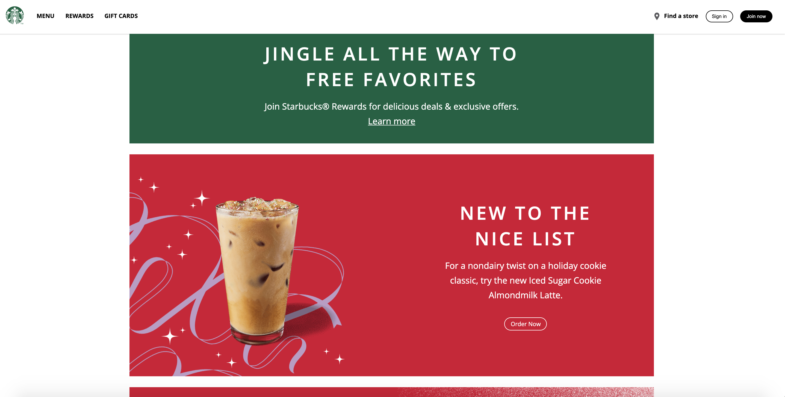

# starbucks-clone

This project was made by following the tutorial 'Build a Starbucks Landing Page Clone' by Traversy Media on YouTube: https://www.youtube.com/watch?v=x_n2FGNsm0o&ab_channel=TraversyMedia.

The application implements HTML, CSS and Vanilla Javascript. It is a clone of the Starbucks landing page and is fully responsive. There is a bit of Javascript to animate the mobile hamburger menu.

I followed this tutorial to brush up on my HTML and CSS knowledge, and I wanted to create something fun during the holiday season.

